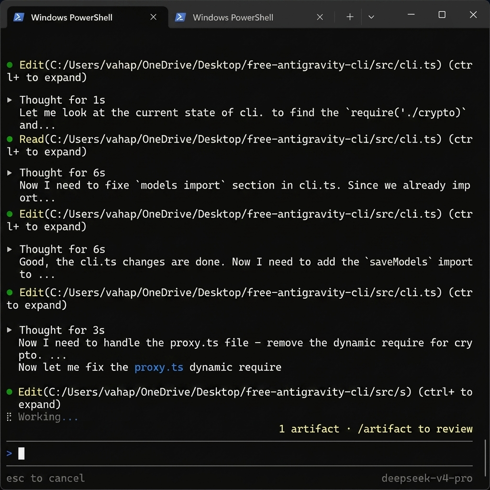

# Free Antigravity CLI

[](https://www.npmjs.com/package/free-antigravity-cli)
[](LICENSE)
[](https://github.com/vahapogut/free-antigravity-cli/stargazers)

**Open Source Community Edition** — Wraps the official [Antigravity CLI](https://antigravity.google/cli) (`agy`) with custom AI model support.

Use **OpenAI, Anthropic, Ollama, OpenRouter, Google AI Studio, and any OpenAI-compatible provider** alongside Gemini models — all through the native `agy` CLI experience.

<p align="center">
  
</p>

<p align="center"><i>Use OpenAI, Claude, Llama and more inside the native agy CLI</i></p>


## Quick Links

* [How It Works](#how-it-works)
* [Quick Start](#quick-start)
* [Prerequisites](#prerequisites)
* [Commands](#commands)
* [Supported Providers](#supported-providers)
* [Installation](#installation)
* [Configuration](#configuration)
* [Technical Details](#technical-details)
* [Update Resilience](#update-resilience)
* [Development](#development)
* [Testing](#testing)
* [Troubleshooting](#troubleshooting)
* [FAQ](#faq)
* [Changelog](#changelog)
* [Security](#security)
* [Comparison](#comparison)
* [Contributing](#contributing)
* [Acknowledgments](#acknowledgments)
* [License](#license)


## How It Works

```
antigravity
  ├── Starts local proxy (port 50998)
  ├── Auto-patches agy.exe to route through proxy
  └── Delegates to agy CLI
        ├── Google models → daily-cloudcode-pa.googleapis.com (transparent)
        └── Custom models → injected by proxy into model list
```

The CLI is a thin wrapper: it starts a local HTTP proxy that intercepts `fetchAvailableModels` API calls, injects your custom model definitions, then hands off to the official `agy` CLI. You get the full native Antigravity CLI experience plus custom models.


## Quick Start

```bash
# 1. Install official Antigravity CLI first
curl -fsSL https://antigravity.google/cli/install.cmd -o install.cmd && install.cmd && del install.cmd

# 2. Install Free Antigravity CLI
npm install -g free-antigravity-cli

# 3. Add your custom models
antigravity models add

# 4. Start chatting (all models appear in agy's model selector)
antigravity
```


## Prerequisites

* **Node.js** >= 18
* **Official Antigravity CLI** (`agy`) installed at one of the default locations
* **Google Account Sign-In**: The CLI uses the desktop Antigravity app's authentication. You must be signed in to [Antigravity Desktop](https://antigravity.google) first. The CLI does not have its own login flow.
  * **Windows**: `%LOCALAPPDATA%\agy\bin\agy.exe`
  * **macOS**: `~/Library/Application Support/agy/bin/agy` or `~/.local/share/agy/bin/agy`
  * **Linux**: `~/.local/share/agy/bin/agy`
* **Custom Binary Path**: If you installed `agy` in a custom location, you can set the path using the `AGY_BIN` environment variable:
  ```bash
  export AGY_BIN="/path/to/custom/agy"
  ```


## Commands

```
antigravity              Start interactive chat (proxy + agy)
antigravity chat         Same as above
antigravity models list  List configured custom models
antigravity models add   Add a new custom model (interactive wizard)
antigravity models remove <name>  Remove a custom model
antigravity models import  Import models from desktop Antigravity
antigravity configure    Show configuration info
antigravity version      Show version
antigravity help         Show this help
```

### Options
* **`--verbose` / `--debug`**: Can be passed to any command to enable proxy request/response logging for troubleshooting.

Any arguments not listed above are passed directly to `agy` CLI.


## Supported Providers

| Provider | CLI Value | Auth |
|---|---|---|
| **OpenAI** | `openai` | API Key (`sk-...`) |
| **Anthropic** | `anthropic` | API Key (`sk-ant-...`) |
| **Google AI Studio** | `google` | API Key (`AIza...`) |
| **Ollama (Local)** | `ollama` | None |
| **OpenRouter** | `openrouter` | API Key |
| **DeepSeek** | `deepseek` | API Key |
| **Groq** | `groq` | API Key |
| **Mistral** | `mistral` | API Key |
| **Cerebras** | `cerebras` | API Key |
| **Kimi (Moonshot)** | `kimi` | API Key |
| **Fireworks AI** | `fireworks` | API Key |
| **LM Studio (Local)** | `lmstudio` | None |
| **llama.cpp (Local)** | `llamacpp` | None |
| **NVIDIA NIM** | `nvidia` | API Key |
| **Custom (OpenAI-compatible)** | `custom` | API Key |


## Installation

### npm (Recommended)

```bash
npm install -g free-antigravity-cli
antigravity
```

### From Source

```bash
git clone https://github.com/vahapogut/free-antigravity-cli.git
cd free-antigravity-cli
npm install
npm run build
npm link
antigravity
```


## Configuration

Models are stored in `~/.free-antigravity/models.json`:

```json
{
  "models": [
    {
      "name": "models/gpt-4o",
      "displayName": "GPT-4o (OpenAI)",
      "provider": "openai",
      "apiKey": "sk-...",
      "apiUrl": "https://api.openai.com/v1/chat/completions",
      "externalModelName": "gpt-4o"
    },
    {
      "name": "models/claude-opus-4-7",
      "displayName": "Claude Opus 4.7",
      "provider": "anthropic",
      "apiKey": "sk-ant-...",
      "apiUrl": "https://api.anthropic.com/v1/messages",
      "externalModelName": "claude-opus-4-7"
    },
    {
      "name": "models/llama3",
      "displayName": "Llama 3 (Local)",
      "provider": "ollama",
      "apiKey": "none",
      "apiUrl": "http://localhost:11434/v1/chat/completions",
      "externalModelName": "llama3"
    }
  ]
}
```

### Importing from Desktop Antigravity

```bash
antigravity models import
```

> **NOTE:** API keys from the desktop app are encrypted with Electron's `safeStorage` and cannot be decrypted by the CLI. After importing, re-enter your API keys via `antigravity models add`.


## Technical Details

### Binary Patching

On first run, the CLI automatically patches `agy` to replace hardcoded Google API URLs with the local proxy. Starting with **v1.1.0**, the patching system is **update-resilient**:

* **Flexible Patching**: Uses null-byte padding to handle URL replacements of different lengths, so even if Google changes endpoint strings, the patch adapts automatically.
* **Runtime URL Discovery**: Scans the `agy` binary at startup for any `*.googleapis.com` URLs and patches them dynamically — no hardcoded list required.
* **Versioned Backups**: Original binaries are backed up with the agy version and timestamp (e.g. `agy.exe.bak-1.2.3-2026-05-25T00-30-28-323Z`) for easy rollback.
* **Automatic Rollback**: If the proxy health check fails after patching, the CLI automatically restores the most recent working backup.

```
https://daily-cloudcode-pa.googleapis.com  → http://localhost:50998/v1internal/xxxxxxx
https://cloudcode-pa.googleapis.com        → http://localhost:50998/v1internal/x
```

This forces `agy` to route ALL API calls (`fetchAvailableModels`, `loadCodeAssist`, etc.) through the local proxy, where custom model definitions are injected into both the `models` list and `agentModelSorts` (required for models to appear in the agy model selector).

Old patches (from previous versions using port 50999) are automatically upgraded.

**Port Isolation:** The CLI proxy uses port **50998** by default, separate from the desktop Antigravity proxy on port 50999. Both can run simultaneously without conflict. If port 50998 is busy, the proxy falls back to a dynamic port automatically.

#### macOS Code Signing and Quarantine
On macOS, patching the binary invalidates its code signature. The CLI automatically runs ad-hoc self-signing via `codesign` and clears macOS quarantine flags via `xattr` to ensure the patched binary runs without OS security alerts.

### Proxy Server

The proxy runs on `http://127.0.0.1:50998` (with automatic fallback if busy) and:

1. **Intercepts `fetchAvailableModels`**: Merges custom model definitions into both `models` and `agentModelSorts` in the response
2. **Intercepts `generateContent`/`streamGenerateContent`**: Routes custom model requests to external APIs with format translation
3. **URL normalization**: Strips binary patch padding from incoming requests before forwarding to Google
4. **Translates formats**: Gemini ↔ OpenAI / Anthropic / Ollama / Google AI Studio
5. **Transparent forwarding**: All other requests pass through to Google unchanged
6. **Graceful fallback**: If the Google API is unreachable, returns custom models directly with proper sort ordering

### Provider Translation

| Provider | Request Translation | Response Translation | Streaming |
|---|---|---|---|
| **OpenAI** | Gemini → Chat Completions | Chat Completions → Gemini | SSE delta → Gemini chunks |
| **Anthropic** | Gemini → Messages API | Messages → Gemini | SSE events → Gemini chunks |
| **Ollama** | Gemini → OpenAI-compatible | OpenAI → Gemini | Same as OpenAI |
| **Google AI Studio** | Passthrough (native Gemini) | Passthrough | SSE chunks |
| **OpenRouter** | Same as OpenAI | Same as OpenAI | Same as OpenAI |
| **Custom** | Same as OpenAI | Same as OpenAI | Same as OpenAI |


## Update Resilience

Free Antigravity CLI v1.1.0+ includes several mechanisms to stay compatible when Google updates the `agy` binary:

| Feature | Description |
|---|---|
| **Runtime URL Discovery** | Automatically discovers all `*.googleapis.com` URLs inside the `agy` binary and patches them, even if Google adds new endpoints. |
| **Flexible Patching** | Patches URLs of different lengths using null-byte padding, so exact length matches are no longer required. |
| **Versioned Backups** | Each patch creates a timestamped backup tagged with the agy version, making it easy to restore a specific version. |
| **Auto-Rollback** | If patching fails or the proxy doesn't start, the CLI automatically restores the most recent working backup. |
| **Remote Patch Manifest** | The CLI can load updated patch strategies from a remote manifest on GitHub, with offline fallback to a local cache and bundled defaults. |
| **Version Compatibility Check** | On startup, warns if your `agy` version hasn't been tested with the current CLI version, so you know when to report issues. |

### How It Works

```
agy binary updated by Google
         ↓
free-antigravity-cli starts
         ↓
├─ Runtime scan: discovers ALL *.googleapis.com URLs
├─ Flexible patch: replaces them with localhost proxy
├─ Proxy health check: verifies everything works
├─ Fail? → Auto-rollback to latest versioned backup
└─ Success → Custom models available in agy selector
```

> **Note:** If Google makes a radical change (e.g. removes all plaintext URLs or switches to a completely different architecture), binary patching may no longer be possible. In that case, please [open an issue](https://github.com/vahapogut/free-antigravity-cli/issues).


## Development

The project uses **TypeScript** with ESLint and Prettier for code quality.

```bash
# Install dependencies
npm install

# Build
npm run build

# Run tests
npm test

# Lint
npx eslint src/

# Format
npx prettier --write src/
```

### Code Quality

| Tool | Purpose |
|---|---|
| **TypeScript** | Strict type checking (`tsc --noEmit`) |
| **ESLint** | Static analysis, no `require()` enforcement |
| **Prettier** | Consistent code formatting |
| **Jest** | Unit + integration tests |

---

## Testing

A comprehensive unit and integration test suite is provided using Jest to verify translation mechanics and proxy interception.

```bash
# Run tests
npm test
```


## Troubleshooting

**"You are currently not signed in" / "No models available"**

The CLI does not have its own login flow. You must sign in via the desktop Antigravity app first:

1. Open **Antigravity Desktop** (installed separately)
2. Sign in with your Google account
3. Close and reopen the CLI: `antigravity`

**"Port 50998 is already in use"**

A previous CLI session may still be running. Kill stale processes:

```bash
# Windows
taskkill //F //IM agy.exe

# macOS/Linux
pkill agy
```

**"Patch failed" / "Rolling back to backup"**

This can happen when Google updates `agy` and the patch doesn't apply cleanly. The CLI automatically restores the most recent working backup. To manually restore:

```bash
# Find the latest backup
ls ~/.local/share/agy/bin/agy.bak-*

# Restore (macOS/Linux)
cp ~/.local/share/agy/bin/agy.bak-<version>-<timestamp> ~/.local/share/agy/bin/agy

# Restore (Windows — PowerShell)
Copy-Item "$env:LOCALAPPDATA\agy\bin\agy.exe.bak-*" "$env:LOCALAPPDATA\agy\bin\agy.exe"
```

If the issue persists after a rollback, try updating `free-antigravity-cli`:

```bash
npm install -g free-antigravity-cli@latest
```

**Custom models not appearing in agy**

1. Verify models are added: `antigravity models list`
2. Ensure API keys are valid (desktop-imported keys may need re-entry)
3. Restart the CLI after adding models


## FAQ

**Q: Is a Google account required?**

Yes. The CLI does not have its own login flow. You must sign in to the desktop Antigravity app first with a Google account. The CLI reuses that authentication.

**Q: Are my API keys safe?**

API keys are stored in `~/.free-antigravity/models.json` and encrypted with AES-256-CBC using a machine-specific key derived from your username. They are never sent to Google or any third party except the provider you configured (e.g. OpenAI, Anthropic).

**Q: Will this break when Google updates `agy`?**

Starting with v1.1.0, the CLI includes **update-resilient patching**: runtime URL discovery, flexible null-byte padding, versioned backups, and automatic rollback. Most updates are handled automatically. See [Update Resilience](#update-resilience) for details.

**Q: Can I use this without installing the official Antigravity CLI?**

No. This tool wraps the official `agy` CLI, which must be installed separately. The CLI patches `agy` at runtime to inject custom models.

**Q: Why are my desktop-imported API keys not working?**

Desktop Antigravity encrypts API keys with Electron's `safeStorage`, which the CLI cannot decrypt. After importing, re-enter your API keys via `antigravity models add`.

**Q: Can I run the proxy on a different port?**

The proxy uses port **50998** by default. If that port is busy, it automatically falls back to a dynamic port. You do not need to configure this manually.

**Q: Does this work on macOS with Gatekeeper?**

Yes. On macOS, the CLI automatically re-signs the patched binary with `codesign --force --sign -` and clears quarantine flags with `xattr`. If you still see a security warning, you may need to allow it in **System Settings → Privacy & Security**.

**Q: How do I completely uninstall?**

```bash
# Uninstall the CLI
npm uninstall -g free-antigravity-cli

# Remove configuration
rm -rf ~/.free-antigravity

# Restore original agy binary from backup
# (see Troubleshooting → "Patch failed" for restore commands)
```


## Changelog

### v1.1.0 (2025-05-25)

- **feat**: Update-resilient binary patching system
  - Flexible `patchUrlFlexible()` with null-byte padding for variable-length URLs
  - Runtime `discoverGoogleUrls()` to find and patch new Google endpoints automatically
  - Versioned backups (`agy.exe.bak-<version>-<timestamp>`) for traceable rollback
  - Automatic rollback on patch failure via `rollback.ts`
- **feat**: Remote patch manifest loader (`manifest.ts`) with offline cache fallback
- **feat**: Agy version compatibility check on startup
- **test**: 9 new compatibility tests (`tests/compat.test.ts`)
- **docs**: Updated README with Update Resilience section, troubleshooting, and demo screenshot

### v1.0.20

- Initial stable release with support for 15+ providers
- Binary patching, proxy interception, and format translation
- Model management (add, remove, list, import from desktop)
- Streaming and non-streaming custom model requests


## Security

### Reporting Vulnerabilities

If you discover a security issue, please **do not open a public issue**. Instead, contact the maintainer directly at **vahap.ogut@outlook.com** or via [LinkedIn](https://www.linkedin.com/in/abdulvahap-ogut-343992398/).

### How API Keys Are Protected

| Layer | Protection |
|---|---|
| **Storage** | `~/.free-antigravity/models.json` (user home, not world-readable) |
| **Encryption** | AES-256-CBC with machine-specific key derived from `process.env.USERNAME` |
| **Transport** | Sent only to the provider you configured (OpenAI, Anthropic, etc.) via HTTPS |
| **Memory** | Decrypted only when needed; not logged or persisted in plain text |

### macOS Code Signing

Patching the `agy` binary invalidates its original code signature. The CLI automatically:
1. Backs up the original binary
2. Applies the patch
3. Re-signs with `codesign --force --sign -`
4. Clears quarantine with `xattr -d com.apple.quarantine`

If you prefer not to patch, you can manually configure a system-wide proxy instead (advanced).

| Feature | Free Antigravity CLI | Google agy CLI |
|---|---|---|
| **Open Source** | Yes (Apache 2.0) | No |
| **Custom Models** | Yes | No |
| **OpenAI / Anthropic / Ollama** | Yes | No |
| **Gemini** | Yes | Yes |
| **All agy Features** | Yes (wraps agy) | Yes |
| **Size** | ~90 KB | 151 MB |
| **npm Install** | Yes | No |
| **Auto-updates** | Via npm | Built-in |
| **Update Resilience** | Yes (v1.1.0+) | N/A |


## Contributing

Pull requests welcome at [github.com/vahapogut/free-antigravity-cli](https://github.com/vahapogut/free-antigravity-cli).


## Acknowledgments

- Thanks to the **Antigravity** team for building the `agy` CLI that this project wraps.
- Thanks to all **contributors** who reported issues, tested patches, and submitted PRs.
- Special thanks to the **open-source AI community** for making multi-provider access possible.


## License

Apache License 2.0 - see [LICENSE](LICENSE).


## Author

**Developed By [Abdulvahap Ogut](https://www.linkedin.com/in/abdulvahap-ogut-343992398/)**
